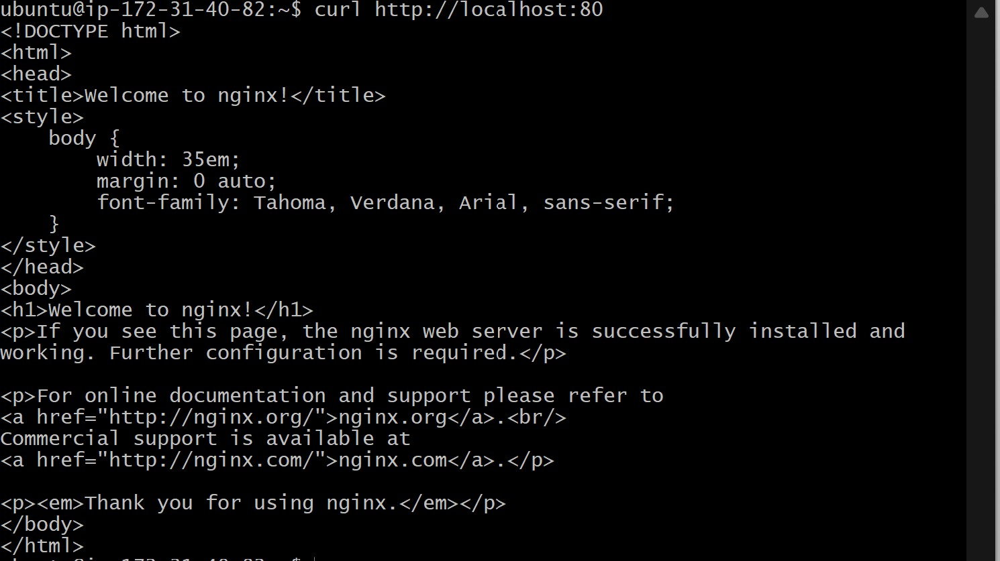

# Project-2: LEMP STACK IMPLEMENTATION

## STEP 1 - Installing the NGNIX Web Server

`sudo apt update`

`sudo apt install nginx`

### verify nginx installation

`sudo systemctl status nginx`

### verify local access on port 80

`curl http://localhost:80`

### verify web access

`curl -s http://169.254.169.254/latest/meta-data/public-ipv4`

## Step 2 - Installing mysql

`sudo apt install mysql-server`

`sudo mysql`

`ALTER USER 'root'@'localhost' IDENTIFIED WITH mysql_native_password BY 'PassWord.1';`

`$ sudo mysql_secure_installation`

## Step 3 - Installing Php

`sudo apt install php-fpm php-mysql`

## Step 4 - configuring nginx to use php processor

`sudo mkdir /var/www/projectLEMP`

`sudo chown -R $USER:$USER /var/www/projectlemp`

`sudo nano /etc/nginx/sites-available/projectLEMP`

`sudo ln -s /etc/nginx/sites-available/projectLEMP /etc/nginx/sites-enabled/`

`sudo nginx -t`

`sudo unlink /etc/nginx/sites-enabled/default`

# Step 5 - Testing PHP with Nginx

`sudo nano /var/www/projectLEMP/info.php`

# Step 6 - Retrieving data from mysql database with php

`CREATE DATABASE `example_database`;`

`CREATE USER 'example_user'@'%' IDENTIFIED WITH mysql_native_password BY 'password';`

`mysql -u example_user -p`

`CREATE TABLE example_database.todo_list (item_id INT AUTO_INCREMENT, content VARCHAR(255),PRIMARY KEY(item_id));`

`INSERT INTO example_database.todo_list (content) VALUES ("My first important item");`

`INSERT INTO example_database.todo_list (content) VALUES ("My second important item");`

`nano /var/www/projectLEMP/todo_list.php`

